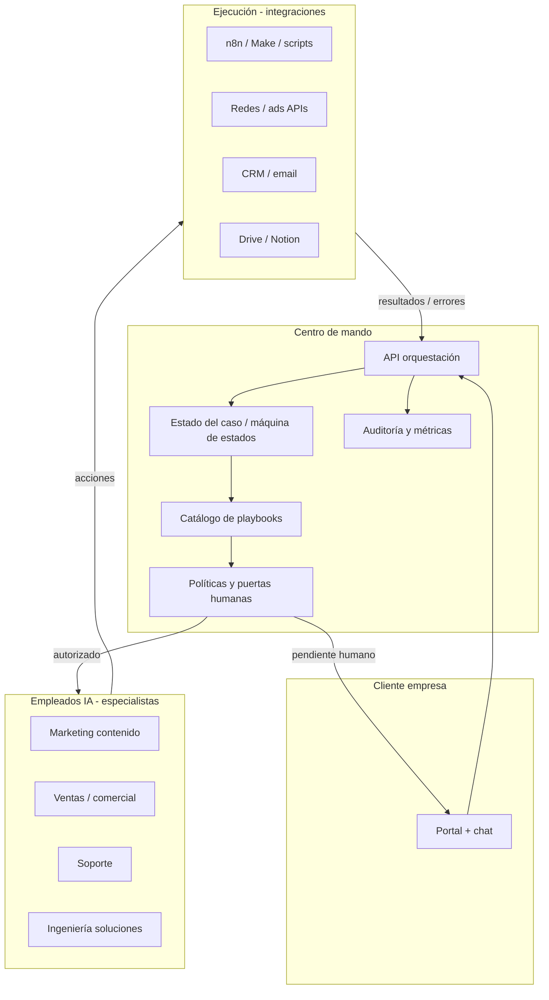

# Centro de mando — Arquitectura (Matic Solutions)

Tu objetivo: un sistema que **en cada escenario** sepa **qué playbook ejecutar**, con **empleados IA** autónomos dentro de **límites** y con **tu aprobación** solo donde importa (precio, compromiso, riesgo).

**n8n/Make no son el cerebro.** Son **brazos**: webhooks, APIs, publicar, CRM, email. El “saber exactamente qué hacer” vive en otra capa: **orquestación con estado + políticas + playbooks versionados**.

---

## Visión en una frase

> **Chat del cliente** y **eventos del sistema** generan **hechos** → el **motor de orquestación** elige un **playbook**, avanza **pasos**, llama a **especialistas IA** y a **integraciones**, y se **detiene en puertas humanas** hasta que tú (o reglas) desbloqueas.

---

## Capas (quién hace qué)

| Capa | Función | Ejemplos |
|------|---------|----------|
| **Portal + chat** | Entrada del cliente, valor visible, historial | Tu producto |
| **API orquestación** | Crear “caso”, recibir mensajes, disparar pasos | Endpoint único que todo atraviesa |
| **Estado (case/ticket)** | Dónde va cada pedido: `nuevo` → `en_análisis` → `pendiente_aprobación` → `en_ejecución` → `cerrado` | Tabla `cases` + `case_events` |
| **Playbooks** | Secuencia **fija** de pasos por tipo de escenario | YAML/JSON versionado en repo |
| **Políticas** | Qué puede hacer la IA sola vs qué requiere rol `owner` | “Publicar sin tu OK: no” hasta tier X |
| **Especialistas IA** | Prompt + herramientas permitidas + salida estructurada | Un agente por dominio |
| **n8n/Make** | Llamadas HTTP, OAuth, colas, cron, reintentos | Sin lógica de negocio compleja |

---

## Cómo se logra “EXACTAMENTE en cada escenario”

No es magia del modelo: es **catálogo explícito**.

1. **Tipos de evento** (entrada)  
   Ejemplos: `cliente.chat.mensaje`, `cliente.solicitud.implementacion_ia`, `sistema.cron.semanal_mkt`, `integracion.metricas.redes`, `soporte.incidencia`.

2. **Clasificador** (ligero)  
   LLM o reglas: devuelve `intención` + `entidades` (canal, urgencia, producto).  
   Si la confianza es baja → playbook `escalar_a_humano`.

3. **Mapa intención → playbook**  
   Tabla cerrada, sin improvisación:

   | Intención (ejemplo) | Playbook ID |
   |---------------------|-------------|
   | `contenido.crear_lote` | `mkt-semana-v1` |
   | `venta.seguimiento_lead` | `vta-followup-v1` |
   | `soporte.tecnico` | `sup-l1-diagnostico-v1` |
   | `implementacion.ia_proceso` | `ing-discovery-a-arquitectura-v1` |

4. **Pasos del playbook**  
   Cada paso define: `rol` (MKT/VTA/…), `entrada`, `salida_esperada` (schema JSON), `herramientas`, `siguiente_paso` o `rama_si_error`, `puerta_humana` (sí/no).

5. **Puertas humanas** (tus “última palabra”)  
   Ejemplos típicos: precio, alcance contractual, publicación en cuenta del cliente, acceso credenciales producción, mensaje que compromete SLA.

Ahí es donde **tú** ves el panel: “Aprobar / Rechazar / Editar” sin rehacer el flujo a mano.

---

## Empleados IA autónomos (definición operativa)

Un “empleado IA” no es un chat libre: es un **contrato**:

- **Permisos:** qué APIs puede llamar (solo borradores vs publicar).
- **Entrada:** contexto del caso + políticas del cliente.
- **Salida:** JSON validado (post, métricas resumidas, siguiente pregunta al cliente).
- **Límites:** tokens, reintentos, y **siempre** registro en `case_events`.

Marketing autónomo hasta el límite que **tú** fijes en política (ej. “borrador automático; publicación solo tras `approved_by_owner`”).

---

## Relación con tu plataforma cliente–agencia

| Necesidad en producto | Dónde vive |
|------------------------|------------|
| Cliente ve valor | Timeline del caso + entregables + KPIs ligados a playbooks |
| Cliente pide IA en procesos desde chat | Mensaje crea/actualiza `case`, clasificador elige playbook `ing-*` |
| Tú te centras en reuniones y precios | Playbooks paran en `puerta_humana: pricing` o `proposal_send` |
| Equipo “trabaja solo” | Especialistas + ejecución hasta la siguiente puerta |

---

## Por qué no basta “un solo agente grande”

Un modelo sin fronteras **mezcla** ventas, legal y técnico, y **alucina** procedimientos. El centro de mando **impone** orden: primero clasificar, luego playbook, luego paso, luego validación.

---

## Cómo construirlo (fases realistas)

### Fase 1 — Cerebro en texto (ya empezado)

- `AGENTS.md` + este documento + plantillas.
- Lista de **20–30 escenarios** con playbook **en papel** (Notion/markdown): disparador → pasos → puerta humana.

### Fase 2 — Caso y estado en base de datos

- Modelo mínimo: `Organization`, `Case`, `CaseEvent`, `PlaybookRun`, `HumanTask` (aprobaciones).
- El chat del portal solo escribe eventos y lee estado.

### Fase 3 — Motor v1

- Servicio (Node/Python) que: recibe evento → carga playbook → ejecuta pasos → llama OpenAI/Anthropic con **function calling** o salida JSON schema → escribe eventos.
- n8n solo para side-effects (email, Slack, subir archivo).

### Fase 4 — Especialización y políticas

- Políticas por cliente (tier): qué playbooks pueden auto-ejecutar publicación, etc.
- Dashboard de “cola de aprobaciones” para ti.

### Fase 5 — Observabilidad

- Métricas por playbook: tiempo, tasa de escalado humano, satisfacción, errores de integración.

---

## Catálogo de escenarios (implementado en la web)

- Documento humano: [`agencia/escenarios-centro-mando.md`](escenarios-centro-mando.md) (28 escenarios).
- Datos y clasificador demo: `web/src/command-center/` (`scenarios.ts`, `classifyIntent.ts`).
- **Consola operador (interna):** en `web`, crear `.env.local` con `VITE_OPERATOR_CONSOLE=true`, ejecutar `npm run dev` y abrir **`/operator/centro-de-mando`**. Sin esa variable, la ruta redirige al inicio: los clientes del portal **no** ven playbooks ni escenarios.
- El chat del portal cliente muestra solo un **acuse cordial**; la clasificación queda para backend o para `console.info` en desarrollo con consola operador activada.

## Próximo artefacto recomendado

Crear `agencia/playbooks/README.md` con **un playbook piloto** completo en YAML (un solo flujo, ej. “Cliente pide automatizar un proceso”) y validarlo contigo antes de codificar el backend.

---

## Resumen

| Idea errónea | Realidad |
|--------------|----------|
| “n8n es el centro de mando” | n8n ejecuta tareas; el **orden y las reglas** son el centro de mando |
| “Un LLM decide todo” | El LLM **ejecuta pasos** dentro de playbooks y políticas |
| “Autonomía total” | Autonomía **hasta la puerta humana**; ahí está tu palanca de control |

Tu producto para clientes (flujos eficientes en **sus** empresas) reutiliza el **mismo patrón**: playbooks + estado + integraciones; solo cambian los actores y las políticas.
